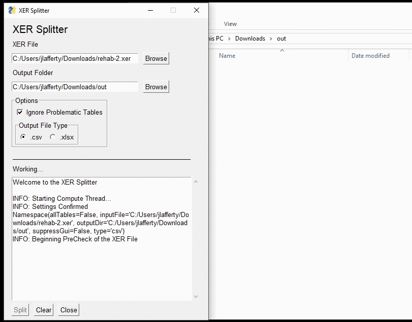

# XER-Splitter
A tool to handle the parsing of Oracles Primavera P6 .XER output files.
Convert your .XER files into seperate CSVs for parsing and transforming in other tools (eg. PowerBI for reporting)



## Features include
- CSV or XLSX output of .XER files
- GUI and CLI available
- Optionally ignore problematic RISKTYPE & POBS tables
- Basic metrics (Total tables & rows)
- Sample XERs [here](tests/Example-XERs)

## Installation

### Command line

Use [pip](https://pypi.org/project/xersplitter/) to install XER-Splitter:

``` 
pip install xersplitter
```

This puts xersplitter on the PATH, allowing you to invoke the gui or use the command line arguments.

### GUI

Alternatively if you just want the gui, the latest build (windows .exe) can be found [here](https://github.com/JaiLaff/XER-Splitter/tree/master/dist) or you can build the file yourself using [pyinstaller](https://pypi.org/project/PyInstaller/) from the root folder

```
pyinstaller xersplitter/Splitter.py --onefile
```

## Usage


```
usage: xersplitter [-h] [-csv | -xlsx] [-i] [-o] [-cli] [-a]

A script to parse those pesky .xer files from Primavera P6

optional arguments:
  -h, --help           show this help message and exit
  -csv                 Comma seperated output
  -xlsx                Excel file output
  -i , --inputFile     The path to the input .xer file
  -o , --outputDir     The directory where the output files will be placed
  -cli, --suppressGui  Hide the GUI - opens by default
  -a, --allTables      Parse all tables - Skips possibly problematic RISKTYPE & POBS tables by default
```

## License
[GPL v3.0](https://github.com/JaiLaff/XER-Splitter/blob/master/LICENSE)

